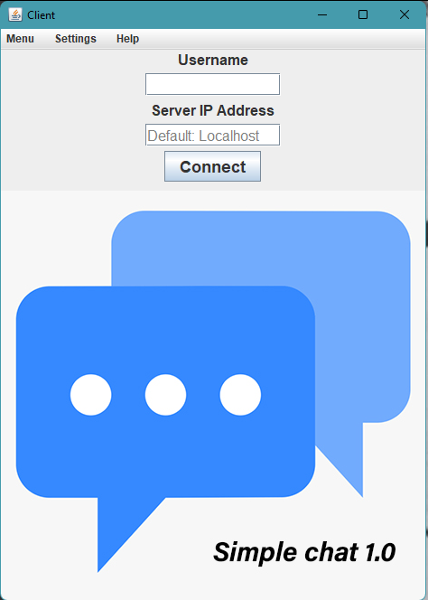
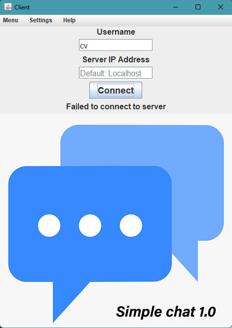
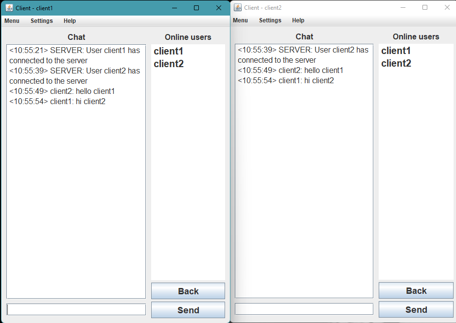
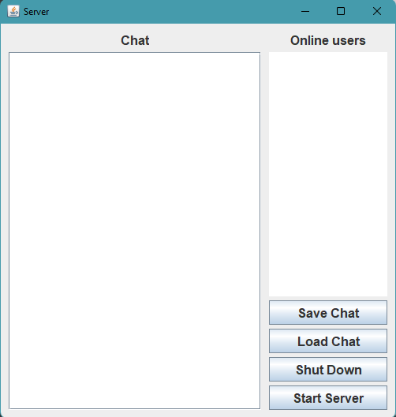
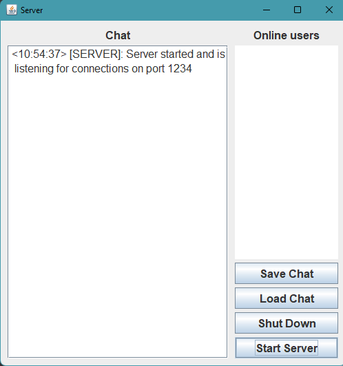

# Java-Client-Server-Chat
A Client-Server chat application made in Java using Java Swing for front-end and Java Sockets for back-end

## Preview

### Client
The client is first presented with a login window. The login window has 2 fields - the **username** of the client and the **server IP address** that the client wishes to connect to. The default Server IP Address is localhost - the clients own computer.
 

If the server is not running on the IP address specified by the client, the client will get an error message *"Failed to connect to Server"*.

If the server is running on the IP address specified by the client, the client will be presented with a chat window where they can see all the users that are connected to the server and can chat with them. The image below shows 2 different clients talking to each other.

### Server
The server is made up of a single window with 4 buttons:  
**Save Chat**: Save the chat log to a text file   
**Load Chat**: Load the chat from a text file   
**Shut Down**: Shut down the server. All clients will be disconnected. (This function is not implemented yet)   
**Start Server**: Starts the Server. The server needs to be started in order for clients to be able to connect to it.   

When we start the server, it will tell us that the server is listening for connections on port 1234. Now, clients can connect to it if they specify the correct Server IP address.  

